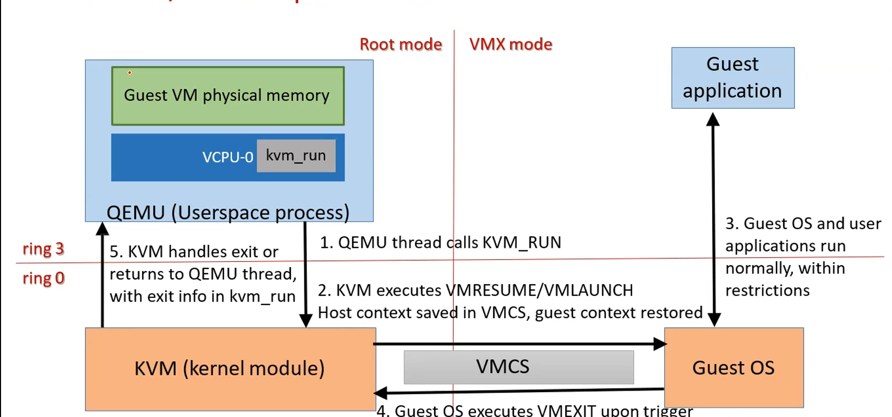

# Lecture 4

## Hardware Virtualization

* Virtualization is now done at the hardware level -> Significant boost in performance
* VMMs can operate in a "dual mode" - it makes use of HW virtualization if available. otherwise, it makes use of software solutions (trap and emulate + binary translation)

## Techniques to virtualize x86

* Paravirtualization
* Full Virtualization

Note - In Paravirtualization, modification is done at compile time. In full virtualization, it is done dynamically at run time. The latter has higher overhead than the former.

* Hardware virtualization
  * CPU has a new, special VMX mode (Virtual Machine Extensions), in which the guest OS could be executed
  * x86 has 4 rings on non-VMX root mode, and another 4 rings in VMX mode

Whenver there is a `Host OS/VMM` running (ring 0 - Non-VMX root mode), and if the Host app (ring 3) needs to run VM -> run VMX mode to run VM, run `Guest app` (ring 3) on Guest OS (ring 0 - VMX mode).\
After execution, control returns to the VMM/Host OS (ring 0 - Non-VMX root mode)

### Solution idea -

* Two new modes of operation - `root` and `non-root` (`Non-VMX` and `VMX` modes)
  * Each mode has complete set of execution rings (0 - 3)
  * New instructions to switch betweem modes

```text
                        VM 0                            VM 1
                        ------------------              ------------------
                        Ring 3 - Guest app              Ring 3 - Guest App
Non root mode -         Ring 2                          Ring 2
                        Ring 1                          Ring 1                          
                        Ring 0 - Guest OS               Ring 0 - Guest OS


                Ring 3  (Legacy/un-virtualized) user program
Root modes  -   Ring 2
                Ring 1  ____________________________________________________________
                Ring 0      Hypervisor/VMMs                               
```

## KVM and QEMU

* Intel VT-x and AMD-v supported hardware virtualization
* KVM - Operates in root mode, QEMU operates in non root mode

```text
    QEMU - Userspace process    - set up memory for guest VM, and VCPUs as part of userspace process
    KVM - Kernel module         - Switches to VMX mode to run guestt
    CPU with VMX mode           - CPU switches between non-root and root modes
```

* QEMU/KVM - super combination of hardware virtualization and binary translation
* If there is no hardware support available, QEMU works using Binary Translation. If there is hardware assist available, and KVM is enabled, then QEMU instructs KVM to switch to VMX mode, and run the Guest OS.

## QEMU Architecture - Heart of Hardware Virtualization

* QEMU operates in userspace
* KVM operates in kernel space
* KVM has a dummy device - `/dev/kvm`
* QEMU talks to KVM via `/dev/kvm` using `open` and `ioctl`
* Every guest VM needs memory and VCPUs assigned to it
* Whenever QEMU has a request to start a VM -
  * QEMU creates a file desciptor to `/dev/kvm` (for itself, using `open`)
  * QEMU uses `mmap()` - sets up and allocates physical memory in userspace for the VM, and then makes an `ioctl` call to get the file descriptor to `/dev/kvm`
  * For every VCPU required, QEMU creates a thread in userspace, and then will do an `ioctl` call to get a file descriptor to `/dev/kvm`
* As far as KVM is concerned, QEMU is just an userland, multithreaded process


## VMX mode

* Special CPU Instructions (some of them are listed below) -
  * VMLAUNCH - launch a VM. VMX mode is enabled, and guest OS is run in VMX mode
  * VMRESUME - resume a VM (which was resumed for instructions, or in a halted state)
  * VMEXIT - invoked by guest OS to exit VMX mode
* On ever VMX entry/exit, the VMX-capable CPU switches context between host OS and Guest OS (hardware manages the mode switch)
* CPU context needs to be stored during mode switch. Cannot be stored in host OS or Guest OS data structures alone. VMCS/VMCB - VM-Control Structure/VM Control Block to the rescue.
  * Common memory area accesssible in both modes (KVM - root mode, and Guest OS - VMX mode can both access, handle this).
  * Host CPU context, Guest CPU context, Guest entry/execution/exit control area, and exit information are stored in VMCS


