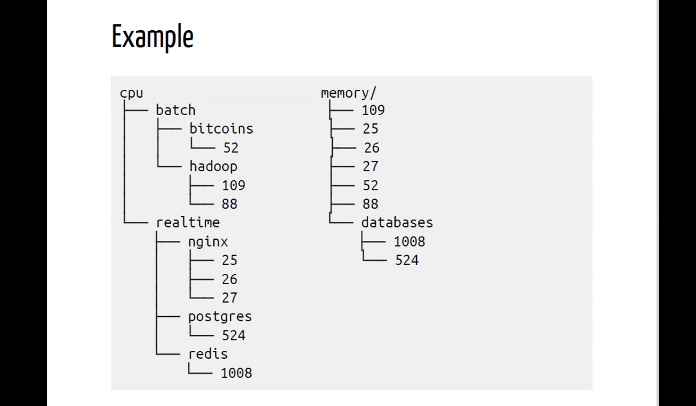

# Lecture 8

## NOTE

```markdown
Watch IBM cloud videos!
```

## Container

* Isolated Environment
* Self Contained
* Lightweight Isolation Mechanism - No OS
* Provides virtualization at the OS level
* Provide a way to virtualize an OS so that multiple workloads can run on a single OS instance
* VM minus the OS
* Docker doesn't provide container tech. It is like an LXC (LinuX Container) wrapper, which makes LXC easy to use.
* Operate in the user-space
* A container is a sandbox (execution environment) such that processes in the container -
  * can't access non-shared objects that belong to other containers
  * access only subset of objects (e.g. files, resources) on physical machines
* A container engine has a CLI and a runtime engine

* It "feels" like a VM -
  * own process space
  * own network interface
  * can run stuff as root
  * can install packages
  * can run services
  * can mess up routing, iptables, etc

* It is not like a VM -
  * uses host kernel
  * can't boot different OS
  * can't have its own modules
  * doesn't need `init` as `PID 1`
  * doesn't need `syslogd`, `cron`, ...

Two building blocks of containers are `Namespaces` and `Cgroups`.

## CGROUPS - Control Groups

* Defines HOW MUCH of a resource can you use ("you" here is a process running in a cgroup)
* Used for resource metering and limiting
  * memory
  * CPU
  * block I/O
  * network

Think of each of these resources as individual "root directories" (they are cgroups by themselves). Within these "directories", you can have "subdirectories", (each of which are cgroups). You can have hierarchies of such cgroups.\
Within this hierarchy, you can associate a process to any cgroup. Once you've associated a process to a cgroup, the limiting conditions defined by the cgroup get associated with/are applicable to the process. If there are multiple proceses, then the limiting conditions defined by the cgroup are applicable to the sum total of all the processes defined under the cgroup.\
(if cgroup `X` has 60% utilization, then the maximum sum total performance that 2 process under `X` is 60%. As in, the cumulative CPU usage of all processes belonging to `X` cgroup must amount to 60%)\
Similarly, if you've hierarchially defined a cgroup within a cgroup, then the newly defined cgroup is constrained by the limiting conditions defined by the parent cgroup.

Every resource can have cgroups assigned in a hierarchial manner, which is realized as files.

### Generalities

* Each subsystem has a hierarchy tree
* Hierarchies are independent
* Each process belongs to exactly one node in the hierarchy
* Each hierarchy starts with one node
* Each node refers to a group of processors



### Memory cgroup

* Keeps track of pages used by each group
* Each page is "charged" to a group
* Pages can be shared across groups

* Each group can have optional hard limits and soft limits
* Soft limits aren't enforced
* Hard limits trigger per-group OOM killer (can be customized)
* Limits can be set for physcial, kernel, and total memory

### CPU cgroup

* Keep track of user/system CPU time
* Keep track of usage per CPU
* Allows you to set limits.

* If limits are hit by process(es), then process(es) gets throttled to adhere to the limits

### Cpuset cgroup

* Pin groups to specific CPUs
* Reserve CPUs for apps
* Avoid processes bouncing between CPUs
* Provides extra dials and knobs (more configurability - per zone memory pressure, etc)

### Blkio cgroup

* Keeps track of I/Os for each group
  * per block device
  * read vs write
  * sync vs async  

* Set throttle limits
  * per block device
  * read vs write
  * ops vs bytes

* Set relative weights for each cgroup

### Net_cls and net_prio cgroup

* Automatically set traffic class/priority for traffic generated by processes in cgroup
* Only works for egress traffic

### Device cgroups

* Control what group can do on device nodes (read, write, mknode)

### Note

Namespaces and Cgroups help enforce access control and resource isolation for a container.\
They are orthogonal to each other.

## Namespaces

* Restrict the objects that a process can see/access
  * E.g. - Restrict process and container to subset of files, use file namespaces, etc.
* Defines WHAT you can see ("you" here is a process running in a namespace)
* Provides processes with their own view of the system
* Each process is in one namespace of each type

### PID Namespace

* Processes within a PID namespace can only see other process in the same PID namespace
* Each namespace has its own numbering system (starting from 1)
* When PID 1 goes away, the whole namespace is killed
* Namespaces can be nested - one way relationship
* Process ends up having multiple PIDs (one per namespace nested in it)

### Net Namespace

* Processes within a network namespace get their own private network stack, including,
  * network interfaces
  * routing tables
  * iptables rules
  * sockets

### Mnt namespace

* Process can have their own root fs (thanks to `chroot`)
* Processes can also have "private" mounts
* Mounts can be totally private or shared
* No easy to way pass along a mount from one one namespace to another

### UTS namespace

* Processes can set their own `gethostname`/`sethostname` per namespace

### IPC and User Namespace

```text
Note - these were mentioned, but weren't explained.
```

## Containers v/s VMs

```markdown
Refer to IBM cloud video.
```

## 3 general steps for creating containers

* Create Manifest
* Create Image
* Create Container itself
