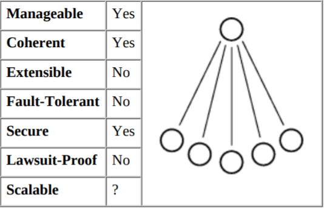
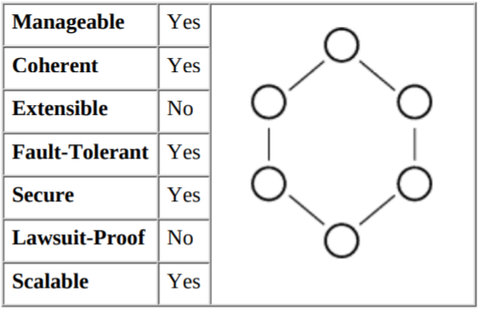
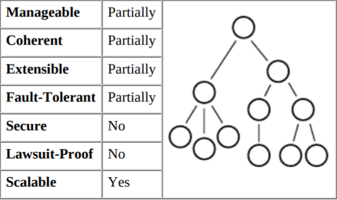
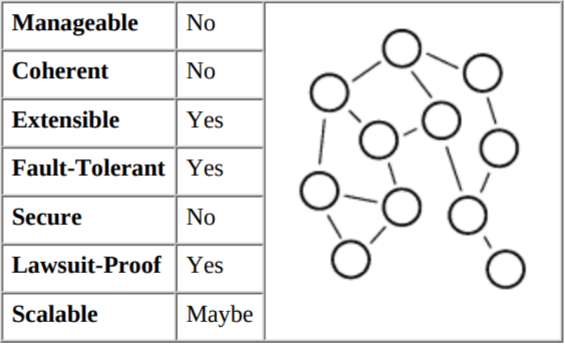
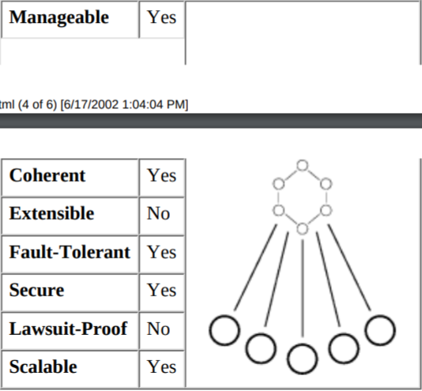
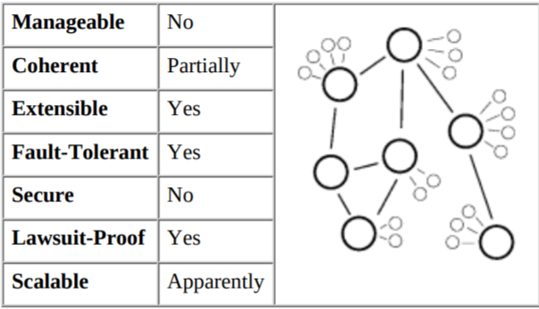

# Lecture 1

## Distributed Systems

* System with multiple components - located on different machines that can communicate and coordinate actions in order to appear as a single coherent system to the end user.

## Distributed Systems Architecures

Two main architectures -

* Master-Slave Architecture (assymetric roles of nodes)
* P2P Architecture (symmetric roles of nodes)

## Master-Slave Architecture

* 1. Unequal nodes - hierarchy, Vulnerable to SPOF (single point of failure)
* 2. Master acts as a central coordinator - easy decision making
* 3. Underlying system cannot scale out indefinitely
  * Master renders a performance bottleneck as number of slaves is increased

## Client-Server Architecture

* Computing model in which server hosts, delivers, and handles most of the resources and services to be consumed by the clients
* a.k.a Networking-Computing model(as requests and services are delivered over a network)
* Request-Response dynamic - client sends a request, and the server process the request and sends back an appropriate response
* One Server can manage many clients simultaneously. Clients may be connected to many servers at a time, each providing a different set of services

### Example - Email Application

* Email message is created using a mail client program on sender's end
* This message is sent to the server and stored there (POP - post office protocol)
* The server forwards the mail to the reciepient's email client/email server which then forwards it to their client
* Receiver access the received email using their email client

### Example - Chat Application

* Chat clients send user's message to server
* Chat server aggregates messages from all users and sends them to all clients
* Other users' chat clients display the aggregated messages received from chat server

## 3 tier Client-Server Architecture

* Client-Server Architecture pattern
* UI, Business rules and Application logic, and data storage and access are maintained as independent modules, often on separate platforms

```text
        via a network
Client ---------------> Server


                        Browser
                          |
                 ____ Web Server 
                /    - - - - - - - - - - } common gateway exchange
where, Server ------- Application Logic
                \____ Databases and DBMS
```

### Advantages - Client-Server

* Improved Data Sharing - data  is retained by usual business process, and manipulated on server available for designated users
* Integration of Services - clients can access services via a desktop interface
* Shared resources amongst different platforms - app used for Client-Server model is build regardless of the hardware platform/OS
* Data processing capability despite the location
* Easy Maintenance - distributed model, with dispersed responsibilities. easy to perform maintenance tasks on one server. this change that happens with the client unware it ever even occurs - encapsulation
* Security - servers have better control access for enforcing security rules for authorized clients

### Disadvantages - Client-Server

* Overloaded Servers - many requests (frequently, simultaneously) - servers overload - form traffic congestion
* Impact of Centralized Architecture - if a critical server fails, then client requests cannot be handled

#### Note

The above points can be found [here](https://sites.google.com/site/clientserverarchitecture/advantages-of-client-server-architecture)

## Peer-to-Peer Architecture

* 1. Equal Nodes - no hierarchy, no SPOF
* 2. No need for a central coordinator - harder decision making
* 3. Underlying system can scale out indefinitely
* 4. Peers can interact directly - forming groups, sharing contents/services
  * at least one accessible peer should share the data
  * Popular data will be highly availabe, the converse is true as well
* 5. Peers can form a virtual overlay network on top of physical network
  * Logical paths don't usually match physical paths - higher latency
  * Each peer plays a role in routing traffic through the overlay network

### Advantages - P2P

* No central point of failure
* Very high scalability - can add more peers to the system as all peers are alike

### Disadvantages - P2P

* Decentralized coordination - how to keep global state consistent? Distributed coherency protocols help (-> Programmability)
* All nodes are not created equal - different resource specifications (computing power, bandwidth, etc) - can affect overall performance

### P2P - Applications

* File Sharing Applications
  * Distribution, sharing of digital media using P2P technology
  * Nodes on a P2P network - "Peers" - hosts (end-user computers & distribution servers)
  * Improves data availability
  * Increase in bandwidth, digitization and physical media, and capabilities of PCs promoted this growth
  * Ex - Napster (mp3 files), Gnutella (file-sharing), KaZaA (which uses the FastTrack protocol)
* Process Sharing Applications
  * Large-scale computations
  * Ex - SETI@Home (searching for ET), Folding@Home
* Collaborative Applications
  * Real-time collaborations
  * In the form of - IM, Virtual Meetings, shared whiteboareds, teleconferencing, telepresence.
  * Ex - IRC, AOL, games, etc
  
## Topologies

### Centralized



```text
The primary advantage of centralized systems is their simplicity.
Because all data is concentrated in one place, centralized systems are easily managed and have no questions of data consistency or coherence.
Centralized systems are also relatively easy to secure: there is only one host that needs to be protected.
The drawback of centralization is that everything is in only one place.
If the central server goes down, everything does.
There is no fault tolerance, and the system is easy to shut down with a lawsuit.
Centralized systems are also often hard to extend -- resources can only be added to the central system.
The scalability of centralized systems is subtle. Scale is clearly limited by the capacity of the server, and so centralized systems are often thought of as unscalable. But computers are very fast and a single computer can often support all the demands of its users.
For example, a modest computer running a Web server can easily handle hundreds of thousands of visitors a day.
And unlike more complex topologies, the scalability of a centralized system is very easy to measure. So while,
theoretically, centralized systems are not scalable, in practice they often suffice
```

### Ring



```text
Ring systems typically have a single owner. 
This concentration gives them many of the same advantages of centralized systems: 
they are manageable, coherent, and relatively secure from tampering.
The added complexity of the ring is mitigated by fairly simple rules for propagating state between the nodes in a ring.
But the single-owner restriction means rings are also not extensible: 
a user still needs the owner's permission to add a resource like a music file or a Web page into the ring.
Similarly, a lawsuit only needs to shut down the owner to shut down the whole ring.
The advantages of rings over centralized systems are fault tolerance and simple scalability.
If a host goes down in a ring, failover logic makes it a simple matter to have another host cover the problem.
And well-designed rings are scalable -- one can simply add more hosts to the ring and expand the capacity nearly linearly.
```

### Hierarchial

```text
Hierarchical systems have a completely different set of advantages from that of rings.
Hierarchical systems are somewhat manageable in that they have a clear chain of action.
But because these systems have such a broad scope, it can be hard to correct a host with a problem.
Coherence is usually achieved with a cache consistency type of strategy; effective, but not complete.
Hierarchical systems are extensible in that any host in the system can add data, but the rules of data management may limit what information can be added.
(For example, the oreilly.com DNS server can add hosts for oreilly.com, but for no one else.)
Hierarchical systems are more fault-tolerant and lawsuit-proof than centralized systems, but the root is still a single point of failure.
They tend to be harder to secure than centralized systems. If a node high in the hierarchy is subverted or spoofed, the whole system suffers. And it's not just the root that is a risk: if data travels up the branches to the root, then leaf nodes may be able to inject bad information to the system.
The primary advantage of hierarchical systems is their incredible scalability -- new nodes can be added at any level to cover for too much load. This scalability is best demonstrated in DNS, which has scaled over the last 15 years from a few thousand hosts to hundreds of millions.
The relative simplicity and openness of hierarchical systems, in addition to their scalability, make them a desirable option for large Internet systems.
```



### Decentralized



```text
Decentralized systems such as Gnutella have almost the exact opposite characteristics as centralized systems.
The far-flung nature of these networks means the systems tend to be difficult to manage and that data in the system is never fully authoritative.
They also tend to be insecure, in the sense that it is easy for a node to join the network and start putting bad
data into the system.
A primary virtue of decentralized systems is their extensibility.
For example, in Gnutella any node can join the network and instantly make new files available to the whole network. 
Decentralized systems also tend to be fault-tolerant and harder to sue.
The failure or shutdown of any particular node does not impact the rest of the system.
The scalability of decentralized systems is hard to evaluate. In theory, the more hosts you add, the more capable a decentralized network becomes. In practice, the algorithms required to keep a decentralized system coherent often carry a lot of overhead. If that overhead grows with the size of the system, then the system may not scale well. The Gnutella network suffered this problem in the early stages, and it remains to be seen if Gnutella can ever scale to the millions of active users that more centralized architectures enjoy. Scalability of decentralized systems remains an active research topic.
```

### Hybrid

#### Ring-Centralized



```text
Systems that have a ring as their central server often enjoy the best of the simplicity of centralization with the redundancy of a ring. 
The hybrid system is still easily managed, coherent, and secure; the ring does not add much complexity over a purely centralized system.
This combination still has a single owner and therefore is not particularly extensible or lawsuit-proof. The key advantage is that using a ring as the server adds fault-tolerance and scalability.
The power and simplicity of the combination of rings and centralized systems explains why this architecture is so popular with
serious server-based applications such as Web commerce and high-availability databases.
```

#### Centralized-Decentralized



```text
A system combining centralized and decentralized systems enjoys some of the advantages of both.
Decentralization contributes to the extensibility, fault-tolerance, and lawsuit-proofing of the system.
The partial centralization makes the system more coherent than a purely decentralized system, as there are relatively fewer hosts that are holding authoritative data.
Manageability is about as difficult as a decentralized system, and the system is no more secure than any other decentralized system.
The amazing story is the scalability of this hybrid. Internet email runs very well for hundreds of millions of users and has grown enormously since its initial design. FastTrack-based systems have grown very quickly with none of the slowdowns that plagued Napster or Gnutella in their growth. There is growing interest in this kind of hybrid topology as an excellent architecture for peer-to-peer systems.
```
